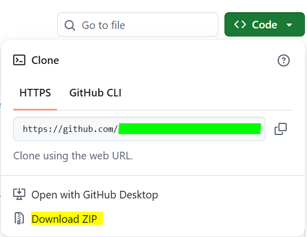

# Personal Portfolio Website

This project is a full-stack personal portfolio website developed to showcase my skills, projects, and professional journey as a physiotherapist transitioning into technology. The platform highlights my interest in building digital solutions for healthcare-related challenges and provides a structured way for visitors to learn about my work and contact me directly.

## Features

1. Responsive design (mobile-friendly)
2. Project showcase section
3. About, Accomplishments and skills section
4. Functional contact form (connected to backend)
5. Clean and user-friendly interface

## Technologies Used

1. HTML
2. CSS
3. JavaScript
4. PHP
5. MySQL

## Project Sturcture

```text
project-folder/
├── index.html
├── style.css
├── script.js
├── connect.php
├── contact.php
├── admin.php 
└── database.sql
```

## Installation Instructions

- Install [XAMPP](https://www.apachefriends.org/download.html) compatible with your OS
- Start `Apache` and `MySQL` services

> 
> Start XAMPP services: `Apache` & `MySQL`

- Download the repository

> 
> Download GitHub Repository

- Extract the .zip file under your XAMPP `htdocs/`

- Open Web browser and type the following the searchbar (omnibox):

```text
localhost/Fatima-Portfolio
```

## Usage

1. Navigate through the website sections (Home, About, Projects, Skills,Accomplishments, Contact)
2. View projects and their descriptions
3. View Accomplishments and more details
4. Use the contact form to send a message
5. Admin can view submitted messages.

## Future Improvements

1. Add authentication system (login/signup)
2. Improve UI with animations
3. Integrate real-time messaging or email notifications
4. Add more projects, accomplishments and case studies
5. Add an AI Agent and FAQs

## Acknowledgements

This project was developed as part of the Women in Tech Program to demonstrate my learning progress and practical skills in full-stack web development.

Special acknowledgement and appreciation to first, Paper Airplanes, then my Tutor Saja Nabeel, and my Mentor [Shahzad](https://github.com/shaizCodes), and finally to all my Web 2 Colleagues.
